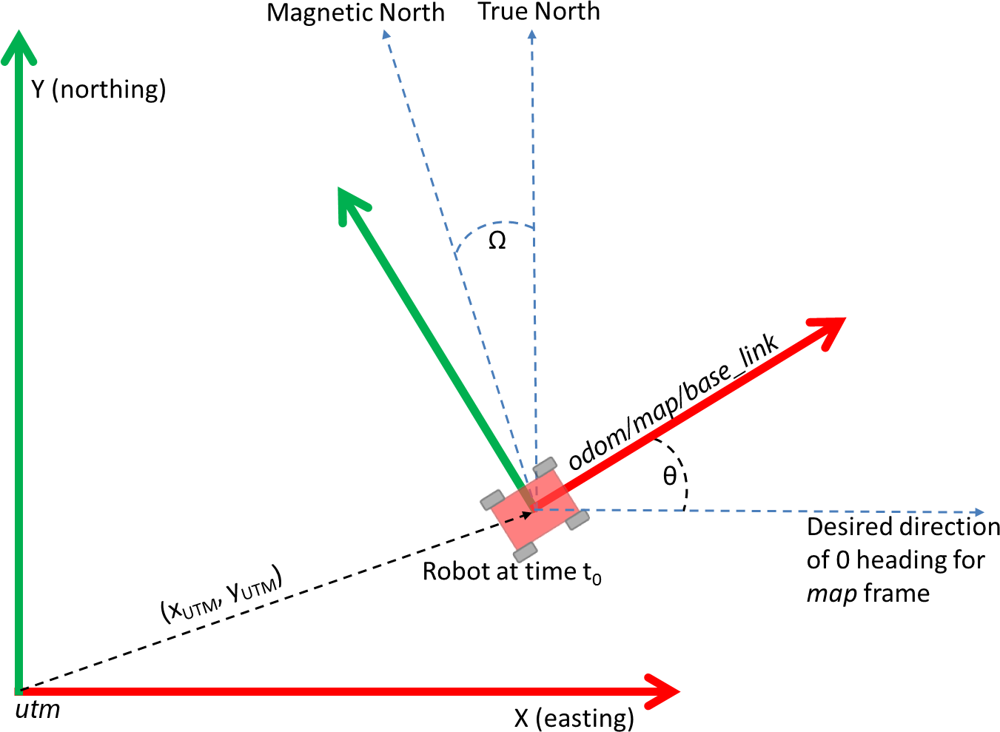

Integrating GPS Data
####################

Integration of GPS data is a common request from users. ``robot_localization`` contains a node, ``navsat_transform_node``, that transforms GPS data into a frame that is consistent with your robot's starting pose (position and orientation) in its world frame. This greatly simplifies fusion of GPS data. This tutorial explains how to use ``navsat_transform_node``, and delves into some of the math behind it.

For additional information, users are encouraged to watch this `presentation <https://vimeo.com/142624091>`_ from ROSCon 2015.

Notes on Fusing GPS Data
************************

Before beginning this tutorial, users should be sure to familiarize themselves with `REP-105 <http://www.ros.org/reps/rep-0105.html>`_. It is important for users to realize that using a position estimate that includes GPS data will likely be unfit for use by navigation modules, owing to the fact that GPS data is subject to discrete discontinuities ("jumps"). If you want to fuse data from a GPS into your position estimate, one potential solution is to do the following:

1. Run one instance of a ``robot_localization`` state estimation node that fuses only continuous data, such as odometry and IMU data. Set the ``world_frame`` parameter for this instance to the same value as the ``odom_frame`` parameter. Execute local path plans and motions in this frame.
2. Run another instance of a ``robot_localization`` state estimation node that fuses all sources of data, including the GPS. Set the ``world_frame`` parameter for this instance to the same value as the ``map_frame`` parameter. 

This is just a suggestion, however, and users are free to fuse the GPS data into a single instance of a ``robot_localization`` state estimation node. 

Using navsat_transform_node
***************************

Required Inputs
===============

``navsat_transform_node`` requires three sources of information: the robot's current pose estimate in its world frame, an earth-referenced heading, and a geographic coordinate expressed as a latitude/longitude pair (with optional altitude). 

These data can be obtained in three different ways:

1. (Default behavior) The data can come entirely from the robot's sensors and pose estimation software. To enable this mode, make sure the ``wait_for_datum`` parameter is set to *false* (its default value). The required messages are:

 * A `sensor_msgs/NavSatFix <http://docs.ros.org/api/sensor_msgs/html/msg/NavSatFix.html>`_ message with raw GPS coordinates in it.
 * A `sensor_msgs/Imu <http://docs.ros.org/api/sensor_msgs/html/msg/Imu.html>`_ message with an absolute (earth-referenced) heading.
 * A `nav_msgs/Odometry <http://docs.ros.org/api/nav_msgs/html/msg/Odometry.html>`_ message that contains the robot's current position estimate in the frame specified by its start location (typically the output of a ``robot_localization`` state estimation node).

2. The datum (global frame origin) can be specified via the ``datum`` parameter. 

 .. note:: In order to use this mode, the ``wait_for_datum`` parameter must be set to *true*.

 The ``datum`` parameter takes this form:

 .. code-block:: xml

  <rosparam param="datum">[55.944904, -3.186693, 0.0, map, base_link]</rosparam>

 The parameter order is ``latitude`` in decimal degrees, ``longitude`` in decimal degrees, ``heading`` in radians) the ``frame_id`` of your robot's world frame (i.e., the value of the ``world_frame`` parameter in a ``robot_localization`` state estimation node), and the ``frame_id`` of your robot's body frame (i.e., the value of the ``base_link_frame`` parameter in a ``robot_localization`` state estimation node). When this mode is used, the robot assumes that your robot's world frame origin is at the specified latitude and longitude and with a heading of :math:`0` (east). 

3. The datum can be set manually via the ``set_datum`` service and using the `robot_localization/SetDatum <http://docs.ros.org/api/robot_localization/html/srv/SetDatum.html>`_ service message. 

GPS Data
^^^^^^^^

Please note that all development of ``navsat_transform_node`` was done using a Garmin 18x GPS unit, so there may be intricacies of the data generated by other units that need to be handled. 

The excellent `nmea_navsat_driver <http://wiki.ros.org/nmea_navsat_driver>`_ package provides the required `sensor_msgs/NavSatFix <http://docs.ros.org/api/sensor_msgs/html/msg/NavSatFix.html>`_ message. Here is the ``nmea_navsat_driver`` launch file we'll use for this tutorial:

 .. code-block:: xml

  <node pkg="nmea_navsat_driver" type="nmea_serial_driver" name="navsat" respawn="true">
    <param name="port" value="/dev/ttyUSB0"/>
    <param name="baud" value="19200"/>
  </node>

This information is only relevant if the user is not manually specifying the origin via the ``datum`` parameter or the ``set_datum`` service.

IMU Data
^^^^^^^^

.. note:: Since version 2.2.1, ``navsat_transform_node`` has moved to a standard wherein all heading data is assumed to start with its zero point facing east. If your IMU does not conform to this standard and instead reports zero when facing north, you can still use the ``yaw_offset`` parameter to correct this. In this case, the value for ``yaw_offset`` would be :math:`\pi / 2` (approximately :math:`1.5707963`).

Users should make sure their IMUs conform to `REP-105 <http://www.ros.org/reps/rep-0105.html>`_. In particular, check that the signs of your orientation angles increase in the right direction. In addition, users should look up the `magnetic declination <http://www.ngdc.noaa.gov/geomag-web/#declination>`_ for their robot's operating area, convert it to radians, and then use that value for the ``magnetic_declination_radians`` parameter.

This information is only relevant if the user is not manually specifying the origin via the ``datum`` parameter or the ``set_datum`` service.

Odometry Data
^^^^^^^^^^^^^

This should just be the output of whichever ``robot_localization`` state estimation node instance you are using to fuse GPS data.

Configuring navsat_transform_node
=================================

Below is the ``navsat_transform_node`` launch file we'll use for this tutorial:

.. code-block:: xml

 <launch>

   <node pkg="robot_localization" type="navsat_transform_node" name="navsat_transform_node" respawn="true">

     <param name="magnetic_declination_radians" value="0"/>

     <param name="yaw_offset" value="0"/>

     <remap from="/imu/data" to="/your/imu/topic" />
     <remap from="/gps/fix" to="/your/gps/fix/topic" />
     <remap from="/odometry/filtered" to="/your/robot_localization/output/topic" />

   </node>

 </launch>

These parameters are discussed on the :ref:`main page <index>`.

Configuring robot_localization
==============================

Integration with ``robot_localization`` is straightforward at this point. Simply add this block to your state estimation node launch file:

.. code-block:: xml

 <param name="odomN" value="/your_state_estimation_node_topic">

 <rosparam param="odomN_config">[true,  true,  false, 
                                 false, false, false, 
                                 false, false, false, 
                                 false, false, false,
                                 false, false, false]</rosparam>
 <param name="odomN_differential" value="false"/>

Make sure to change ``odomN`` to whatever your odometry input values is (e.g., *odom1*, *odom2*, etc.). Also, if you wish to include altitude data, set ``odomN_config``'s third value to ``true``.

.. note:: If you are operating in 2D don't have any sensor measuring Z or Z velocity, you can either:

 * Set ``navsat_transform_node's`` ``zero_altitude`` parameter to *true*, and then set ``odomN_config``'s third value to *true*
 * Set ``two_d_mode`` to *true* in your ``robot_localization`` state estimation node

You should have no need to modify the ``_differential`` setting within the state estimation node. The GPS is an absolute position sensor, and enabling differential integration defeats the purpose of using it.

Details
=======

We'll start with a picture. Consider a robot that starts at some latitude and longitude and with some heading. We assume in this tutorial that the heading comes from an IMU that reads 0 when facing east, and increases according to the ROS spec (i.e., counter-clockwise). The remainder of this tutorial will refer to Figure 1:

`REP-105 <http://www.ros.org/reps/rep-0105.html>`_ suggests four coordinate frames: *base_link*, *odom*, *map*, and *earth*. *base_link* is the coordinate frame that is rigidly attached to the vehicle. The *odom* and *map* frames are world-fixed frames and generally have their origins at the vehicle's start position and orientation. The *earth* frame is used as a common reference frame for multiple map frames, and is not yet supported by ``navsat_transform_node``. Note that in Figure 1, the robot has just started (``t = 0``), and so its *base_link*, *odom*, and *map* frames are aligned. We can also define a coordinate frame for the UTM grid, which we will call *utm*. For the purposes of this tutorial, we will refer to the UTM grid coordinate frame as *utm*. Therefore, what we want to do is create a *utm*->*map* transform.

Referring to Figure 1, these ideas are (hopefully) made clear. The UTM origin is the :math:`(0_{UTM}, 0_{UTM})` point of the UTM zone that is associated with the robot's GPS location. The robot begins somewhere within the UTM zone at location :math:`(x_{UTM}, y_{UTM})`. The robot's initial orientation is some angle :math:`\theta` above the UTM grid's :math:`X`-axis. Our transform will therefore require that we know :math:`x_{UTM}, y_{UTM}` and :math:`\theta`.

We now need to convert our latitude and longitude to UTM coordinates. The UTM grid assumes that the :math:`X`-axis faces east, the :math:`Y`-axis faces (true) north, and the :math:`Z`-axis points up out of the ground. This complies with the right-handed coordinate frame as dictated by `REP-105 <http://www.ros.org/reps/rep-0105.html>`_. The REP also states that a yaw angle of :math:`0` means that we are facing straight down the :math:`X`-axis, and that the yaw increases counter-clockwise. ``navsat_transform_node`` assumes your heading data conforms to this standard. However, there are two factors that need to be considered: 

1. The IMU driver may not allow the user to apply the magnetic declination correction factor
2. The IMU driver may incorrectly report :math:`0` when facing north, and not when facing east (even though its headings increase and decrease correctly). Fortunately, ``navsat_transform_node`` exposes two parameters to adddress these possible shortcomings in IMU data: ``magnetic_declination_radians`` and ``yaw_offset``. Referring to Figure 1, for an IMU that is currently measuring a yaw value of ``imu_yaw``, 

 :math:`yaw_{imu} = -\omega - offset_{yaw} + \theta`

 :math:`\theta = yaw_{imu} + \omega + offset_{yaw}`

We now have a translation :math:`(x_{UTM}, y_{UTM})` and rotation :math:`\theta`, which we can use to create the required *utm* -> *map* transform. We use the transform to convert all future GPS  positions into the robot's local coordinate frame. ``navsat_transform_node`` will also broadcast this transform if the ``broadcast_utm_transform`` parameter is set to *true*. 

If you have any questions about this tutorial, please feel free to ask questions on `answers.ros.org <http://answers.ros.org>`_.

